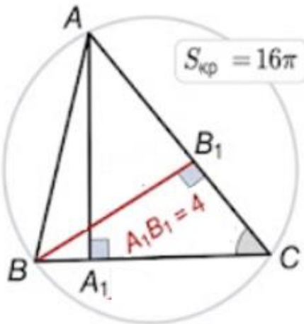
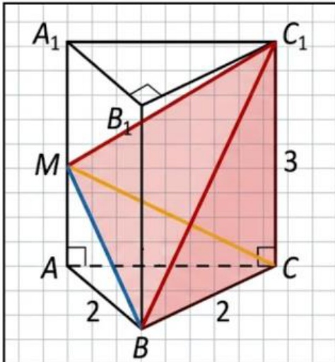

## Единый государственный экзамен по МАТЕМАТИКЕ Тренировочный вариант № 540

@ALEXLARIN_NET

## Профильный уровень Инструкция по выполнению работы

Экзаменационная работа состоит из двух частей, включающих в себя 19 заданий. Часть 1 содержит 12 заданий с кратким ответом базового и повышенного уровней сложности. Часть 2 содержит 7 заданий с развёрнутым ответом повышенного и высокого уровней сложности.

На выполнение экзаменационной работы по математике отводится 3 часа 55 минут (235 минут).

Ответы к заданиям 1–12 записываются по приведенному ниже образцу в виде целого числа или конечной десятичной дроби. Числа запишите в поля ответов в тексте работы, а затем перенесите в бланк ответов № 1.

КИМ Ответ: -0.8

<table border=1 style='margin: auto; word-wrap: break-word;'><tr><td style='text-align: center; word-wrap: break-word;'>10</td><td style='text-align: center; word-wrap: break-word;'>-0,8</td><td style='text-align: center; word-wrap: break-word;'></td><td style='text-align: center; word-wrap: break-word;'></td><td style='text-align: center; word-wrap: break-word;'></td></tr></table>

Бланк

При выполнении заданий 13—19 требуется записать полное решение и ответ в бланке ответов № 2.

Все бланки ЕГЭ заполняются яркими чёрными чернилами. Допускается использование телевой или капиллярной ручки.

При выполнении заданий можно пользоваться черновиком. Записи в черновике, а также в тексте контрольных измерительных материалов не учитываются при оценивании работы.

Баллы, полученные Вами за выполненные задания, суммируются. Постарайтесь выполнить как можно больше заданий и набрать наибольшее количество баллов.

После завершения работы проверьте, чтобы ответ на каждое задание в бланках ответов №1 и №2 был записан под правильным номером.

Желаем успеха!

Справочные материалы

 $$ \sin2\alpha=2\sin\alpha\cdot\cos\alpha $$ 

 $$ \cos2\alpha=\cos^{2}\alpha-\sin^{2}\alpha $$ 

 $$ \sin\left(\alpha+\beta\right)=\sin\alpha\cdot\cos\beta+\cos\alpha\cdot\sin\beta $$ 

 $$ \cos\left(\alpha+\beta\right)=\cos\alpha\cdot\cos\beta-\sin\alpha\cdot\sin\beta $$ 

Часть 1

Ответом к заданиям 1-12 является целое число или конечная десятичная дробь. Во всех заданиях числа предполагаются действительные, если отдельно не указано иное. Запишите число в поле ответа в тексте работы, затем перенесите его в БЛАНК ОТВЕТОВ №1 справа от номера соответствующего задания, начиная с первой клеточки. Каждую цифру, знак «минус» и запятую пишите в отдельной клеточке в соответствии с приведёнными в бланке образцами. Единицы измерений писать не нужно.

1. В остроугольном треугольнике АВС проведены высоты АА $ _{1} $ и ВВ $ _{1} $. Известно, что А $ _{1} $В $ _{1} $ = 4, а площадь описанного около треугольника АВС круга равна 16π. Найдите угол АВС в градусах.

Ответ: ___

2. Даны векторы  $ \vec{a} $ и  $ \vec{b} $, такие что  $ \left|\vec{a}\right|=2 $;  $ \left|\vec{b}\right|=5 $, а угол между ними равен  $ 120^{\circ} $. Найдите квадрат длины вектора  $ \vec{c}=3\vec{a}-\vec{b} $.

Ответ: ___.

3. Основанием прямой треугольной призмы АВСА₁В₁С₁ является равнобедренный прямоугольный треугольник ABC, AB = BC = 2. Точка М – середина бокового ребра АА₁, которое равно 3. Найдите объем пирамиды ВСС₁М.

Ответ: ___.

