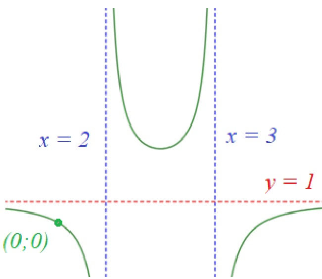

Единый государственный экзамен, 2026 г. Математика, 11 класс

4. Монету подбрасывают до тех пор, пока «орел» не выпадет два раза подряд. Найдите вероятность того, что опыт закончится ровно на четвертом броске.

Ответ: ___.

5. В лабиринте Минотавра 5 дверей. За одной — выход, за остальными — тупики. Герой Тесей открывает двери случайным образом, но если находит тупик, то с вероятностью 0,2 забывает об этом и может проверить эту же дверь снова. Найдите вероятность того, что он найдет выход ровно с третьей попытки.

Ответ: ___.

6. Решите уравнение:  $ x^{2} + 4x - \cos(\pi x) = -5 $

Ответ: ___.

7. Найдите значение выражения:  $ \frac{1}{\log_{2}100!} + \frac{1}{\log_{3}100!} + \ldots + \frac{1}{\log_{100}100!} $.

Ответ: ___.

8. При каком значении параметра $a$ касательная к графику функции $f(x)=x^{3}-3x+2$, проведенная в точке с абсциссой $x_{0}=a$, проходит через точку $M(0;4)?$

Ответ: ___

Тренировочный вариант № 540

9. Для обогрева помещения, температура в котором поддерживается на уровне  $ T_{p}=20^{0}C $, используется нагреватель мощностью P. Температура воздуха на улице  $ T_{out}=-20^{0}C $. Известно, что  $ P=\alpha\cdot\left(T_{P}-T_{out}\right) $, где  $ \alpha=250\frac{Bm}{K} $. На сколько процентов нужно увеличить мощность нагревателя, чтобы поддерживать в помещении температуру  $ 24^{0}C $ при той же температура на улице?

Ответ: ___

10. На квалификации перед гонкой пилот решил проверить предельный износ шин и поехал по трассе 4 часа подряд без заездов в боксы. Известно, что каждый час из-за стирания резины он проезжал ровно на 1 круг меньше, чем в предыдущий. Всего за эти 4 часа непрерывной езды болид намотал 98 кругов.

Какое количество кругов пилот проехал за самый первый час квалификации?

Ответ: ___

11. График функции $y=\frac{x^{2}+ax+b}{x^{2}+cx+d}$ имеет горизонтальную асимптоту $y=1$ и две вертикальные $x=2$ и $x=3$. При этом он проходит через начало координат и не пересекает свою горизонтальную асимптоту. Найдите значение $a+b+c+d$.

Ответ: ___.

12. Найдите наименьшее значение функции  $ y = 2^{x} + 2^{2-x} $.

Ответ: ___.